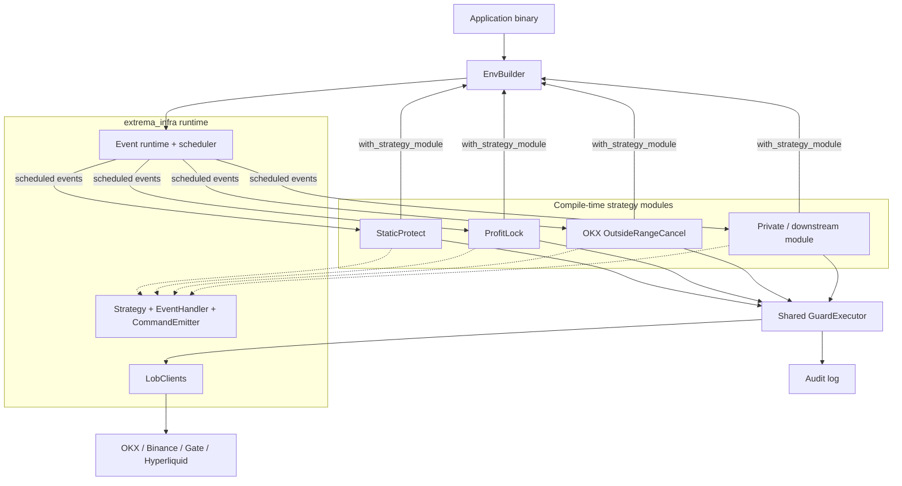

# Extrema Guard

Composable guard strategy modules built on
[extrema_infra](https://crates.io/crates/extrema_infra). Applications select
built-in or private modules at compile time, register them through `EnvBuilder`,
and run them in the same typed event runtime.

`extrema_guard` is not a monolithic trading daemon. It is a reference assembly
and a reusable module library for account protection, order supervision, and
custom exchange policies.

## Architecture



### Design principles

- **Compile-time composition**: built-in and downstream modules implement the
  same `extrema_infra` traits and are registered with
  `EnvBuilder::with_strategy_module`.
- **Module-owned configuration**: every module owns its config type and loader.
  Adding a module does not require modifying a shared god-config type.
- **One execution boundary**: all modules share one `GuardExecutor`, preserving
  per-exchange throttling, dry-run/live behavior, client-order-id rules, and a
  unified audit trail.

Here, pluggable means ordinary Rust modules composed at compile time. There is
no dynamic library ABI or runtime plugin loader.

## Using as a library

A strategy repository depends on both crates: `extrema_infra` supplies the
runtime and exchange contracts, while `extrema_guard` supplies reusable guard
modules and the shared executor.

```toml
[dependencies]
extrema_infra = { version = "0.3.14", features = ["lob_clients"] }
extrema_guard = "0.1.7"
```

Use compatible `extrema_infra` versions in both dependency paths so Cargo
resolves one set of runtime traits and exchange types. The application binary
then chooses the schedule tasks and modules that make up one deployment:

```rust,ignore
use extrema_guard::prelude::*;
use extrema_infra::prelude::*;

let executor = GuardExecutor::connect(&executor_config).await?;

let env = EnvBuilder::new()
    .with_task(schedule_task)
    .with_strategy_module(StaticProtect::new(
        &static_config,
        executor.clone(),
    ))
    .with_strategy_module(MyPrivateGuard::new(
        &private_config,
        executor,
    ))
    .build()?;

env.execute().await;
```

A downstream crate can use the public `extrema_guard` modules, replace the
application binary, or add private modules without changing this repository.

## Built-in modules

| Module | Policy | Action |
|---|---|---|
| `StaticProtect` | Derives stop-loss and take-profit levels from position entry price | Maintains a reduce-only take-profit and closes after a stop breach |
| `ProfitLock` | Tracks the best observed mark after an activation threshold | Closes after the configured profit floor is crossed |
| `OkxOutsideRangeCancel` | Tracks zero-fill OKX entries while last price remains outside their TP/SL range | Cancels after a continuous timeout, 37 minutes by default |

These modules are examples of the same extension surface available to private
strategies. Order ownership and eligibility remain module-level policy rather
than framework-wide restrictions.

## Quickstart

```bash
cp strategy_config.toml.example strategy_config.toml
cargo run --bin guard
```

The example configuration uses `mode = "dry-run"`. Live mode sends real account
actions and also requires `i_understand_live_orders = true`.

`strategy_config.toml` contains one executor section and one section per
selected module. Each loader reads only its own section. See
[`strategy_config.toml.example`](strategy_config.toml.example) for the complete
built-in configuration.

## Adding a module

Use [`examples/guard_custom_template.rs`](examples/guard_custom_template.rs) as a
minimal external-assembly example:

1. Implement `Strategy`, `CommandEmitter`, and the required `EventHandler`
   methods from `extrema_infra`.
2. Keep the module config and loader beside the module, normally in `utils.rs`.
3. Receive a clone of the shared `GuardExecutor` instead of constructing an
   independent exchange client for mutations.
4. Add the module schedule and one `with_strategy_module` call in the binary.

Use `GuardExecutor::exchange_reader` for exchange-specific reads. Route order
placements and cancellations through `GuardExecutor` so live arming, action
throttling, and audit behavior remain process-wide.

## OKX outside-range policy

The OKX module is deliberately narrower than a generic stale-order canceller:

- It scans live `SWAP` and `FUTURES` limit or post-only parent entries.
- The order must have zero fills, `reduceOnly = false`, and one complete fixed
  TP/SL bracket.
- Split attachments, trailing stops, ratio brackets, take-profit limit orders,
  and partially filled orders are not eligible.
- In net mode, an order opposite the current signed position is not treated as
  an entry. In long/short mode, only `buy + long` and `sell + short` qualify.
- It always compares against OKX `last`, independent of the bracket's stored
  trigger-price type.
- Price must remain strictly beyond the same TP or SL boundary for the complete
  configured interval.
- Returning inside, changing breach side, modifying the order, stale price
  data, clock reversal, or an observation gap resets tracking.
- Before cancellation it reloads account mode, net positions, open orders, and
  prices. The candidate must still be eligible and must be the only pending
  order on its instrument. After the cancel ACK, it queries the exact order
  once; an unconfirmed outcome stays tracked for the next schedule.

The timer is persisted atomically in `outside_range_state.toml`, so a short
process restart does not silently turn a continuous-observation policy into an
order-age policy.

## Operational controls

| Control | Behavior |
|---|---|
| Dry-run | Records intended actions without sending them |
| Live arming | Requires both `mode = "live"` and explicit acknowledgement |
| Action rate | Enforces one shared minimum interval per exchange |
| Order size | Applies a shared notional cap to modules that place orders |
| Market sanity | Rejects invalid or non-finite prices |
| Audit | Appends requested actions, acknowledgements, and module events to one log |

Modules remain responsible for strict eligibility, preflight revalidation,
idempotency, and confirmation of exchange outcomes.

## Verification

```bash
cargo fmt --all -- --check
cargo test --all-targets
cargo clippy --all-targets --all-features -- -D warnings
cargo doc --no-deps --all-features
cargo publish --dry-run --all-features
```

## License

This project is licensed under the [Apache 2.0 license](LICENSE).
